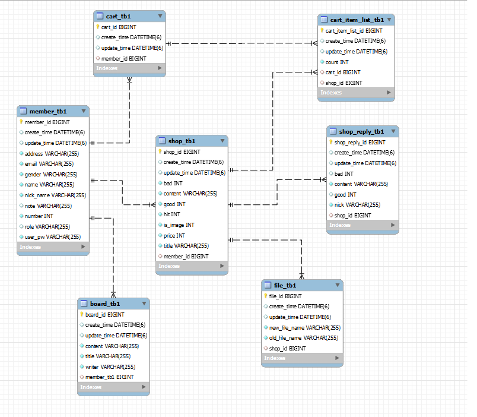
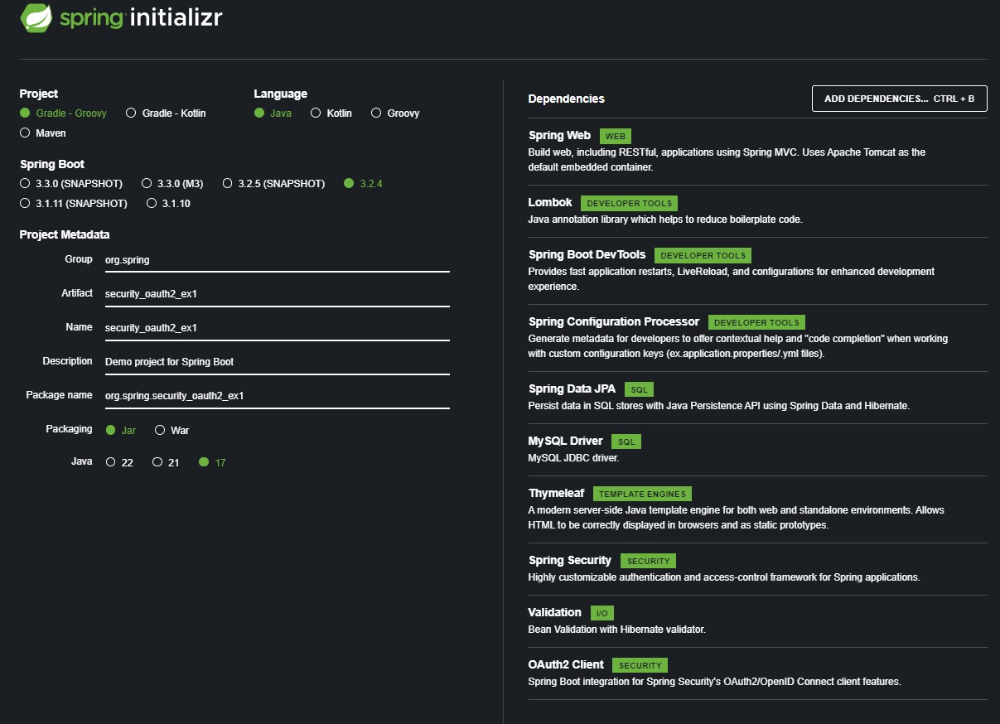

# team_project_1
## final
<details>
<summary>SQL</summary>

````

    create table board_tb1 (
       board_id bigint not null auto_increment,
        create_time datetime(6),
        update_time datetime(6),
        content varchar(255) not null,
        title varchar(255) not null,
        writer varchar(255) not null,
        member_tb1 bigint,
        primary key (board_id)
    ) engine=InnoDB
Hibernate: 
    
    create table board_tb1 (
       board_id bigint not null auto_increment,
        create_time datetime(6),
        update_time datetime(6),
        content varchar(255) not null,
        title varchar(255) not null,
        writer varchar(255) not null,
        member_tb1 bigint,
        primary key (board_id)
    ) engine=InnoDB
2024-04-17 17:08:16.281 DEBUG 1820 --- [  restartedMain] org.hibernate.SQL                        : 
    
    create table cart_item_list_tb1 (
       cart_item_list_id bigint not null auto_increment,
        create_time datetime(6),
        update_time datetime(6),
        count integer not null,
        cart_id bigint,
        shop_id bigint,
        primary key (cart_item_list_id)
    ) engine=InnoDB
Hibernate: 
    
    create table cart_item_list_tb1 (
       cart_item_list_id bigint not null auto_increment,
        create_time datetime(6),
        update_time datetime(6),
        count integer not null,
        cart_id bigint,
        shop_id bigint,
        primary key (cart_item_list_id)
    ) engine=InnoDB
2024-04-17 17:08:16.295 DEBUG 1820 --- [  restartedMain] org.hibernate.SQL                        : 
    
    create table cart_tb1 (
       cart_id bigint not null auto_increment,
        create_time datetime(6),
        update_time datetime(6),
        member_id bigint,
        primary key (cart_id)
    ) engine=InnoDB
Hibernate: 
    
    create table cart_tb1 (
       cart_id bigint not null auto_increment,
        create_time datetime(6),
        update_time datetime(6),
        member_id bigint,
        primary key (cart_id)
    ) engine=InnoDB
2024-04-17 17:08:16.310 DEBUG 1820 --- [  restartedMain] org.hibernate.SQL                        : 
    
    create table file_tb1 (
       file_id bigint not null auto_increment,
        create_time datetime(6),
        update_time datetime(6),
        new_file_name varchar(255) not null,
        old_file_name varchar(255) not null,
        shop_id bigint,
        primary key (file_id)
    ) engine=InnoDB
Hibernate: 
    
    create table file_tb1 (
       file_id bigint not null auto_increment,
        create_time datetime(6),
        update_time datetime(6),
        new_file_name varchar(255) not null,
        old_file_name varchar(255) not null,
        shop_id bigint,
        primary key (file_id)
    ) engine=InnoDB
2024-04-17 17:08:16.324 DEBUG 1820 --- [  restartedMain] org.hibernate.SQL                        : 
    
    create table member_tb1 (
       member_id bigint not null auto_increment,
        create_time datetime(6),
        update_time datetime(6),
        address varchar(255) not null,
        email varchar(255) not null,
        gender varchar(255) not null,
        name varchar(255) not null,
        nick_name varchar(255) not null,
        note varchar(255),
        number integer not null,
        role varchar(255),
        user_pw varchar(255) not null,
        primary key (member_id)
    ) engine=InnoDB
Hibernate: 
    
    create table member_tb1 (
       member_id bigint not null auto_increment,
        create_time datetime(6),
        update_time datetime(6),
        address varchar(255) not null,
        email varchar(255) not null,
        gender varchar(255) not null,
        name varchar(255) not null,
        nick_name varchar(255) not null,
        note varchar(255),
        number integer not null,
        role varchar(255),
        user_pw varchar(255) not null,
        primary key (member_id)
    ) engine=InnoDB
2024-04-17 17:08:16.341 DEBUG 1820 --- [  restartedMain] org.hibernate.SQL                        : 
    
    create table shop_reply_tb1 (
       shop_reply_id bigint not null auto_increment,
        create_time datetime(6),
        update_time datetime(6),
        bad integer,
        content varchar(255) not null,
        good integer,
        nick varchar(255) not null,
        shop_id bigint,
        primary key (shop_reply_id)
    ) engine=InnoDB
Hibernate: 
    
    create table shop_reply_tb1 (
       shop_reply_id bigint not null auto_increment,
        create_time datetime(6),
        update_time datetime(6),
        bad integer,
        content varchar(255) not null,
        good integer,
        nick varchar(255) not null,
        shop_id bigint,
        primary key (shop_reply_id)
    ) engine=InnoDB
2024-04-17 17:08:16.357 DEBUG 1820 --- [  restartedMain] org.hibernate.SQL                        : 
    
    create table shop_tb1 (
       shop_id bigint not null auto_increment,
        create_time datetime(6),
        update_time datetime(6),
        bad integer not null,
        content varchar(255) not null,
        good integer not null,
        hit integer not null,
        is_image integer not null,
        price integer not null,
        title varchar(255) not null,
        member_id bigint,
        primary key (shop_id)
    ) engine=InnoDB
Hibernate: 
    
    create table shop_tb1 (
       shop_id bigint not null auto_increment,
        create_time datetime(6),
        update_time datetime(6),
        bad integer not null,
        content varchar(255) not null,
        good integer not null,
        hit integer not null,
        is_image integer not null,
        price integer not null,
        title varchar(255) not null,
        member_id bigint,
        primary key (shop_id)
    ) engine=InnoDB
2024-04-17 17:08:16.371 DEBUG 1820 --- [  restartedMain] org.hibernate.SQL                        : 
    
    alter table member_tb1 
       add constraint UK_hlohcywqtgbpl02361pgjfgo8 unique (email)
Hibernate: 
    
    alter table member_tb1 
       add constraint UK_hlohcywqtgbpl02361pgjfgo8 unique (email)
2024-04-17 17:08:16.383 DEBUG 1820 --- [  restartedMain] org.hibernate.SQL                        : 
    
    alter table board_tb1 
       add constraint FKdf3y25wfr2ui4ot999dqj6efc 
       foreign key (member_tb1) 
       references member_tb1 (member_id)
Hibernate: 
    
    alter table board_tb1 
       add constraint FKdf3y25wfr2ui4ot999dqj6efc 
       foreign key (member_tb1) 
       references member_tb1 (member_id)
2024-04-17 17:08:16.428 DEBUG 1820 --- [  restartedMain] org.hibernate.SQL                        : 
    
    alter table cart_item_list_tb1 
       add constraint FK3382uk4y3r0ao67do9munktx7 
       foreign key (cart_id) 
       references cart_tb1 (cart_id)
Hibernate: 
    
    alter table cart_item_list_tb1 
       add constraint FK3382uk4y3r0ao67do9munktx7 
       foreign key (cart_id) 
       references cart_tb1 (cart_id)
2024-04-17 17:08:16.487 DEBUG 1820 --- [  restartedMain] org.hibernate.SQL                        : 
    
    alter table cart_item_list_tb1 
       add constraint FKqt0j8a5wt6sikmcwgkq2t8jua 
       foreign key (shop_id) 
       references shop_tb1 (shop_id)
Hibernate: 
    
    alter table cart_item_list_tb1 
       add constraint FKqt0j8a5wt6sikmcwgkq2t8jua 
       foreign key (shop_id) 
       references shop_tb1 (shop_id)
2024-04-17 17:08:16.539 DEBUG 1820 --- [  restartedMain] org.hibernate.SQL                        : 
    
    alter table cart_tb1 
       add constraint FKleoighd0la5002w7sq5jb5ckl 
       foreign key (member_id) 
       references member_tb1 (member_id)
Hibernate: 
    
    alter table cart_tb1 
       add constraint FKleoighd0la5002w7sq5jb5ckl 
       foreign key (member_id) 
       references member_tb1 (member_id)
2024-04-17 17:08:16.579 DEBUG 1820 --- [  restartedMain] org.hibernate.SQL                        : 
    
    alter table file_tb1 
       add constraint FKfp1q35sr0w7xrm8lo8104o45 
       foreign key (shop_id) 
       references shop_tb1 (shop_id)
Hibernate: 
    
    alter table file_tb1 
       add constraint FKfp1q35sr0w7xrm8lo8104o45 
       foreign key (shop_id) 
       references shop_tb1 (shop_id)
2024-04-17 17:08:16.622 DEBUG 1820 --- [  restartedMain] org.hibernate.SQL                        : 
    
    alter table shop_reply_tb1 
       add constraint FKb0ll2vt9dg9js6m4h9rqctmwa 
       foreign key (shop_id) 
       references shop_tb1 (shop_id)
Hibernate: 
    
    alter table shop_reply_tb1 
       add constraint FKb0ll2vt9dg9js6m4h9rqctmwa 
       foreign key (shop_id) 
       references shop_tb1 (shop_id)
2024-04-17 17:08:16.676 DEBUG 1820 --- [  restartedMain] org.hibernate.SQL                        : 
    
    alter table shop_tb1 
       add constraint FKics0iab2we65c5pbvkuu2klfb 
       foreign key (member_id) 
       references member_tb1 (member_id)
Hibernate: 
    
    alter table shop_tb1 
       add constraint FKics0iab2we65c5pbvkuu2klfb 
       foreign key (member_id) 
       references member_tb1 (member_id)

````





</details>

### member
=======
##### asdfasdfasdf
##### asdfasdf
### member
###### READ
# action
# 0509_teamProject1
# 0509_teamProject1
# 0509_teamProjectFinal
# 0509_teamProjectFinal
